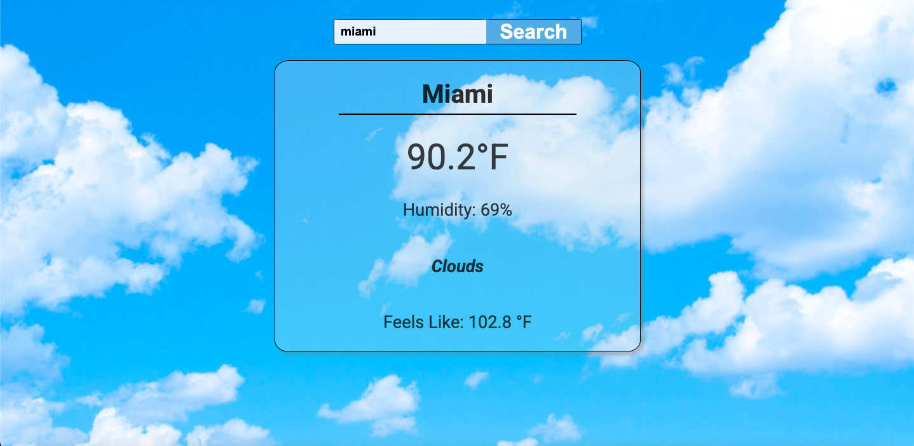
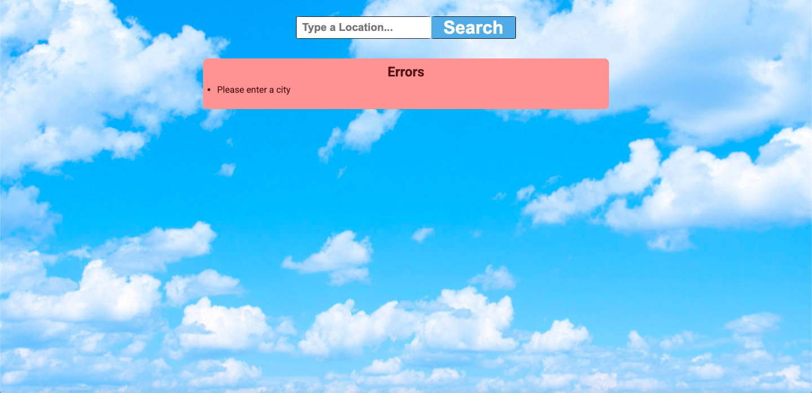

# Weather App

### I made this app because I wanted practice using fetch and API's and a weather app seemed like a fun and useful app to make.

### To make this app I used simple html and css to style and design the page. For the functionality, I used to an API to get the weather information of any city that is typed. When a city is type a card is created and the weather data such as temperature and humidity in that city is displayed. When a new city is searched the previous data will be cleared.

### If an error occurs such as no city being typed or an input that is not a city, then instead of the data card, an error tab will appear notifying the user of the error.

